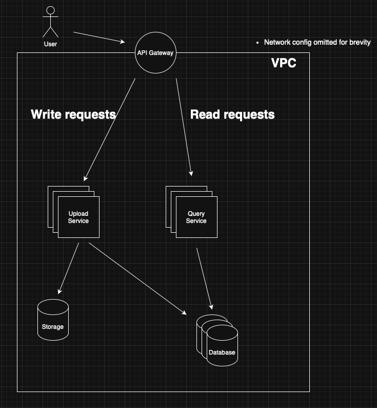

# Distributed Dictionary

## Assumptions

- User interacts with the system through REST APIs
- The system is cloud-native
- Resources

  - All resources are public
  - Repeated upload of the same resource is allowed
  - A book is in PDF format, with title, author, and ISBN
  - A piece of text is in string format, with indefinite length

## Requirements

### Basic (Functional)

- User can upload texts or books
- User can view the texts or books
- User should be able to search texts or books

### Non-Functional

- There is service-level agreement (SLA); user can access the system even when a part of system is down

## System Overview

### User

- Requests to REST APIs through devices

### API Gateway

- The (only) entry point of the system
- Clustered, for high availability (HA)
- Serves as load balancer
- exposes the below endpoints

  - `POST /api/v1/books`
  - `GET /api/v1/books?title=some%20book&author=john%20doe`
  - `GET /api/v1/books/:isbn`
  - `POST /api/v1/texts`
  - `GET /api/v1/texts?content=some%20string%20with%20space`

- Proxies upload requests to upload service

  - `POST /api/v1/books`
  - `POST /api/v1/texts`

- Proxies search requests to query service

  - `GET /api/v1/books?title=some%20book&author=john%20doe`
  - `GET /api/v1/books/:isbn`
  - `GET /api/v1/texts?content=some%20string%20with%20space`

### Upload Service

- In private network
- Clustered servers, for HA
- Stateless
- Scales up/down horizontally based on the load
- Access the write endpoint of the database
- Access the write endpoint of the storage

- Handler `POST /api/v1/books`

  1. Checks if file type from request body is PDF
  2. Uploads the file to the storage
  3. Queries the database to add a book record
  4. Responds with the status, with message that does NOT leak the internal system design

- Handler `POST /api/v1/texts`

  1. Serializes string in request body to prevent attacks like SQL injection or XSS
  2. Queries the database to add a text record
  3. Responds with the status, with message that does NOT leak the internal system design

### Query Service

- In private network
- Clustered servers, for HA
- Stateless
- Scales up/down horizontally based on the load
- Access the read endpoint(s) of the database
- Access the read endpoint(s) of the storage

- Handler `GET /api/v1/books/:isbn`

  1. Serializes request ISBN param to prevent attacks like SQL injection or XSS
  2. Queries the database for a book record
  3. Responds with the status, with message that does NOT leak the internal system design

- Handler `GET /api/v1/books?title=some%20book&author=john%20doe`

  1. Serializes (optional) request params to prevent attacks like SQL injection or XSS
  2. Queries the database for book record(s)
  3. Responds with the status and content (if resources found), with message that does NOT leak the internal system design

- Handler `GET /api/v1/texts?content=some%20string%20with%20space`

  1. Serializes request params to prevent attacks like SQL injection or XSS
  2. Queries the database for text record(s)
  3. Responds with the status and content (if resources found), with message that does NOT leak the internal system design

### Database

- In private network
- Clustered servers, for HA
- One write endpoint, with N read endpoints
- Scales up/down read endpoints horizontally based on the load
- Could be either a relational or a non-relational database system
- Has 2 tables

  - books, with fields of ISBN, title, author, and url (to locate the file in storage)
  - texts, with content field

### Storage

- In private network
- Stores PDF files

## Considerations

- Possible downtime caused by malfunctioned components

  > Could be tested and tuned the capacities of the components from gathering system info with chaos tests

- Whether the additional cost justifies the SLA

  - Redundant gateway/server resources
  - Maintenance overhead of the micro-services, compared to a monolith
  - Storage space

- Possible enhancements

  - Monitoring: Introduce system monitors, like Grafana, and alarms
  - Caching: Apply caching, depending on the needs, to shorten response time and lighten system load

    - Introduce CDN, placed before the API gateway, that caches responses for same request(s)
    - API gateway, caching for same request(s)
    - Introduce cache services, like Redis, between components

  - Database

    - Shard tables, vertically or horizontally, based on the actual usage
    - Add indices, depending on the database system of choice
